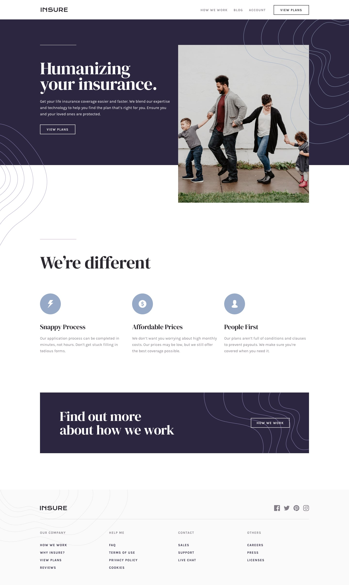
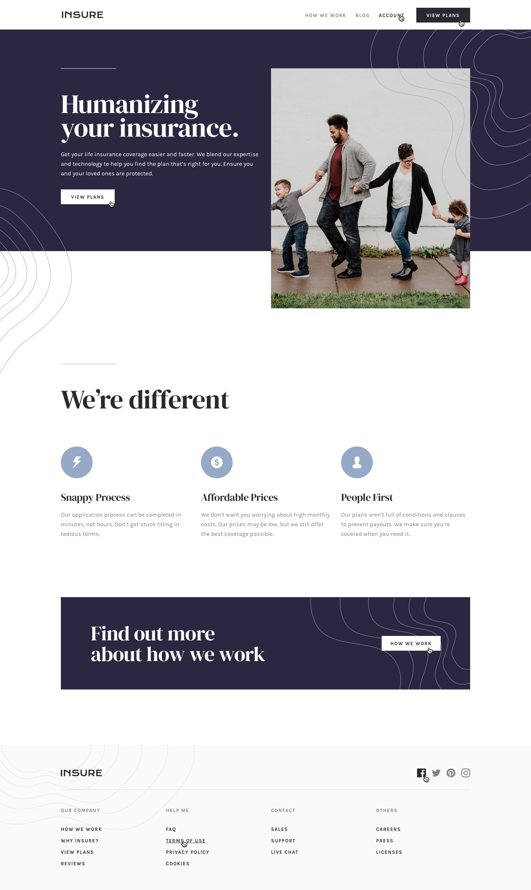
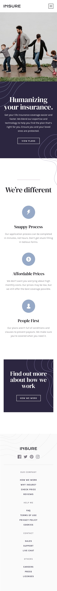
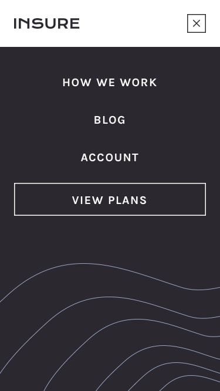

# Frontend Mentor - Solución de Insure Landing Page

Esta es mi solución al desafío **Insure Landing Page** de Frontend Mentor. Este proyecto se centra en desarrollar una landing page moderna y totalmente responsive que se adapta perfectamente a dispositivos de escritorio, tabletas y móviles.

El desafío fue una excelente oportunidad para practicar HTML semántico, diseño responsive, personalización de Tailwind CSS v4, manipulación del DOM con JavaScript y el despliegue de una aplicación lista para producción utilizando Vite y GitHub Pages.

---

## Tabla de contenidos

- [Descripción general](#descripción-general)
- [El desafío](#el-desafío)
- [Diseño](#diseño)
- [Enlaces](#enlaces)
- [Mi proceso](#mi-proceso)
- [Construido con](#construido-con)
- [Lo que aprendí](#lo-que-aprendí)

---

## Descripción general

Este proyecto consiste en una landing page responsive para una compañía de seguros. Cuenta con una interfaz limpia y moderna que incluye un menú de navegación adaptable, una sección principal (hero), tarjetas de características y una sección de llamada a la acción.

El diseño fue desarrollado siguiendo un enfoque **mobile-first** utilizando clases utilitarias de Tailwind CSS, garantizando una experiencia óptima en cualquier tamaño de pantalla.

---

## El desafío

Los usuarios deben poder:

- Visualizar el diseño óptimo según el tamaño de la pantalla de su dispositivo.
- Abrir y cerrar el menú de navegación en dispositivos móviles.
- Cerrar el menú móvil al hacer clic fuera de él.
- Navegar por los elementos interactivos utilizando el teclado.
- Visualizar los estados *hover* y *focus* de todos los elementos interactivos.
- Disfrutar de un diseño responsive en computadoras, tabletas y dispositivos móviles.

---

## Diseño

### Diseño para escritorio



### Estados activos



### Diseño para dispositivos móviles



### Navegación móvil



---

## Enlaces

- URL de la solución: [Repositorio en GitHub](https://github.com/mlopezl/Insure-Landing-Page)
- URL del sitio en vivo: [Demo en línea](https://mlopezl.github.io/Insure-Landing-Page/)

---

## Mi proceso

- Estructuré la página utilizando elementos semánticos de HTML5 como `header`, `nav`, `main`, `section`, `article` y `footer`.

- Seguí un flujo de trabajo **mobile-first** para garantizar una experiencia responsive en diferentes tamaños de pantalla.

- Construí los diseños utilizando Flexbox y clases utilitarias de Tailwind CSS.

- Implementé puntos de quiebre (*breakpoints*) responsivos mediante:

  - `sm:`
  - `md:`
  - `lg:`
  - `xl:`

- Personalicé Tailwind CSS v4 utilizando la directiva `@theme`.

- Creé un sistema de diseño personalizado mediante variables CSS para:

  - Colores
  - Tipografía

- Importé y configuré la fuente **DM Serif Display** desde Google Fonts.

- Utilicé recursos SVG e imágenes optimizadas para mejorar el rendimiento.

- Implementé un menú de navegación responsive utilizando JavaScript.

- Gestioné el estado del menú mediante funciones reutilizables.

- Agregué detectores de eventos para:

  - `click`

- Seleccioné elementos del DOM utilizando:

  - `getElementById()`

- Utilicé métodos del DOM como:

  - `classList.add()`
  - `classList.remove()`
  - `contains()`

- Implementé la detección de clics fuera del menú para cerrarlo automáticamente.

- Añadí transiciones suaves para los estados *hover* y *focus* de los elementos interactivos.

- Compilé y optimicé el proyecto utilizando Vite.

- Generé una versión de producción con:

```bash
pnpm run build
```

- Desplegué la versión de producción en GitHub Pages.

---

## Construido con

- HTML5
- Tailwind CSS v4
- JavaScript (ES6+)
- Flexbox
- Variables personalizadas de CSS (CSS Custom Properties)
- Google Fonts
- Principios de diseño responsive
- Flujo de trabajo Mobile-first
- HTML semántico
- Manipulación del DOM
- Event Listeners
- Personalización del tema de Tailwind CSS
- Vite
- PNPM
- GitHub Pages

---

## Lo que aprendí

- Construir diseños responsive utilizando HTML5 semántico.
- Crear interfaces flexibles con Flexbox y clases utilitarias de Tailwind CSS.
- Trabajar con Tailwind CSS v4 y su nuevo sistema de configuración mediante `@theme`.
- Crear *design tokens* reutilizables mediante variables CSS.
- Importar y configurar fuentes personalizadas desde Google Fonts.
- Gestionar menús de navegación responsive utilizando JavaScript.
- Seleccionar y manipular elementos del DOM con `getElementById()`.
- Manejar las interacciones del usuario mediante *event listeners*.
- Alternar estados de la interfaz agregando y eliminando clases CSS dinámicamente.
- Detectar clics fuera de un elemento utilizando el método `contains()`.
- Organizar el código JavaScript en funciones reutilizables para mejorar su mantenimiento.
- Comprender el flujo de desarrollo y producción de Vite.
- Generar versiones optimizadas para producción con Vite.
- Desplegar aplicaciones frontend estáticas utilizando GitHub Pages.